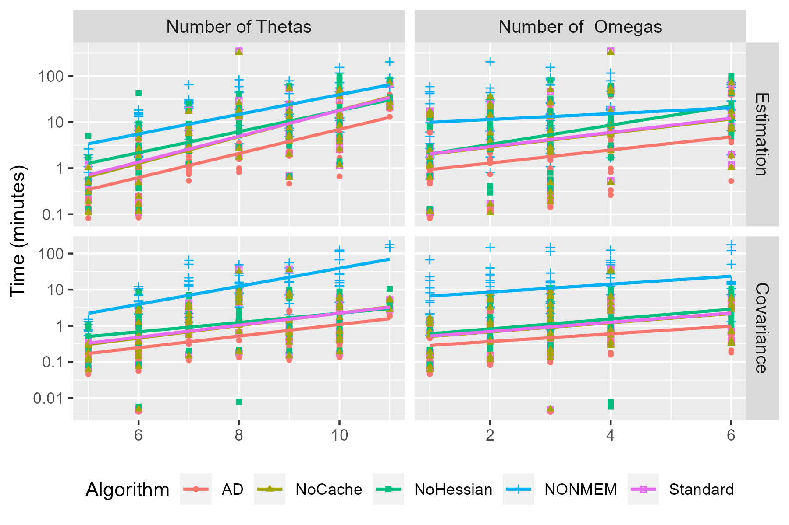
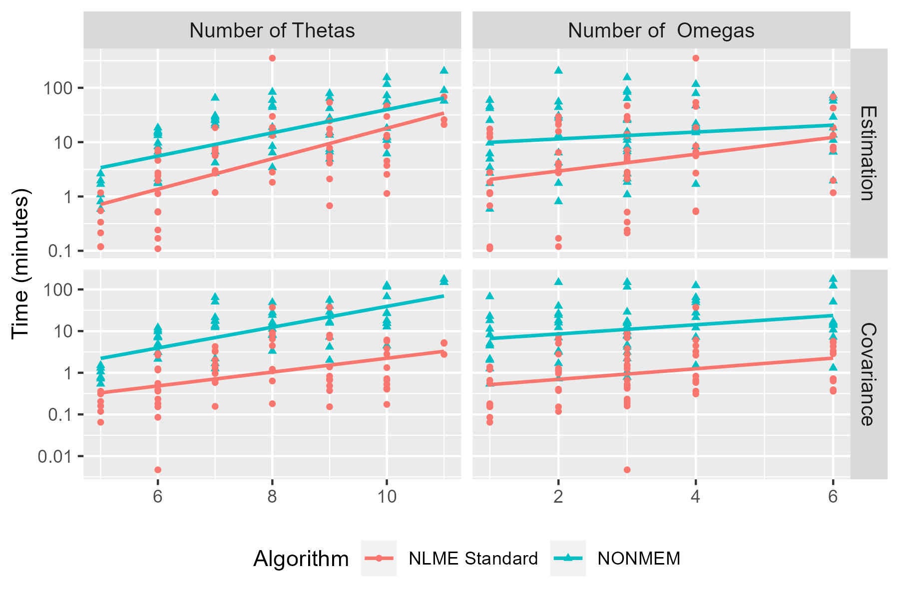

# ADPOBenchmark

## Overview

"ADPO" is an abbreviation for Automatic differentiation parameter optimization. The method has been developed by Certara and integrated into the NLME-Engine, and may present an opportunity for improved performance of parameter optimization in first order conditional method for mixed effects models.

Where "AD" is automatic differentiaion, "standard" is the current release of NLME, "NoHessian" is the standard release with the current estimate of the Hessian matrix is NOT used to initialize the ETA search, and "NoCache" disables caching of certain values. "NONMEM" is NONMEM version 7.43.
Briefly, rather than the finite difference method being used to calculate the gradients WRT ETAs in the conditional step (the "inner loop"), a closed form solution to the derivative is calculated using the chain rule. This approach has been adapted from a [similar approach](https://en.wikipedia.org/wiki/Automatic_differentiation) used in neural networks.

The ADPO method remains under active development with expected release in Phoenix 8.6 and RsNLME 3.1. At this time, we have supplied a set of scripts in the repository to compare the performance across a standard set of models for the currently released NLME-Engine (available in Phoenix 8.5 and RsNLME 3.0) versus NONMEM. Additional scripts to compare ADPO, No Hessian, and No Cache methods will be provided once the next version of the NLME-Engine has been officially released.

## Software requirements

-   R/RStudio
-   R package `Certara.RsNLME` (<https://certara.github.io/R-RsNLME/>)
-   NLME engine (<https://www.certara.com/software/phoenix-nlme/>)

*A free 30 day trial license for the NLME engine to be used with `Certara.RsNLME` is available. Click [here](https://www.certara.com/software/r-speaks-nlme-rsnlme/free-trial/) to request.*

-   NONMEM (<https://www.iconplc.com/solutions/technologies/nonmem>)

*NONMEM is run using the nmfe??.bat command, where ?? is the version of NONMEM (e.g., 7.5 -\> nmfe75.bat)*

## Usage

The scripts provided in the repository run performance benchmarks for "Standard" NLME against NONMEM for 72 ODE models (ADVAN6 and DVERK ODE solvers). These models are fit to simulated data. The simulated data is generated from the same 72 models, so the estimation model is fitting, to the extent possible, the "true" model in all 72 cases. Further, the initial estimates for each model are those used for the simulation.

It is likely that some customization of the script will be needed. At minimum, the path to nmfe??.bat (batch file for executing NONMEM) and the path to the NLME-Engine installation directory should be reviewed for accuracy.

After cloning the repository or downloading local `.zip` archive, open `ADPOBenchmark.Rproj`.

### Run Standard NLME

Open `RunNLME.R` and ensure that the path to the NLME-Engine installation directory in line 4 (Linux) or line 5 (Windows) is correct. After ensuring the path is correct, you may interactively run all lines in the script or `source(RunNLME.R)` from your R console. If you have not used `Certara.RsNLME` previously, there is an initial function to authenticate your license (line 46).

*Note: Estimated execution time for Standard NLME benchmark is \~24 hours*

### Run NONMEM

Open `RunNONMEM.R` and ensure that the path to the nmfe batch file line 6 (Linux) or line 8 (Windows) is correct. After ensuring the path is correct, you may interactively run all lines in the script or `source(RunNONMEM.R)` from your R console.

*Note: Estimated execution time for NONMEM benchmark is \~5 days*

### Make Plots

After the benchmark analysis for NLME and NONMEM is complete, run `MakePlots.R` to generate plot and table comparisons.

|   | Algorithm       | Converge | Covar   |
|---|-----------------|----------|---------|
| 1 | NLME Standard   | 100      | 97.22   |
| 2 | NONMEM          | 70.83    | 83.33   |

Additional outputs are available in the NLMEResults_standard.csv and NONMEMResults.csv file including:
-   Number of iterations
-   Typical value of parameter estimates
-   Root mean square error (RMSE)
-   Mean absolute Error (MAE)

These can be accessed by the user for additional diagnostics such as comparing the typical values of parameters to the "true" value. Note that the best readily available approximation to the "true" values will the mean and SD used for the simulations. However, a better comparison would be the mean and SD of the draws from those distributions. These can be generated by rerunning the script used for the simulation. This script is not provided here, as it requires pyDarwin to run. Interested user can contact us at support@certara.com for help running the simulation.
